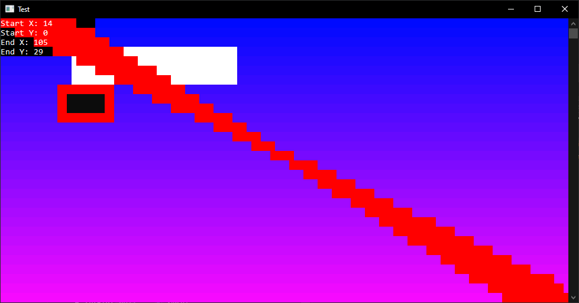

# PrettyConsole

This library is similar to `libcurses` in that it allows for manipulation of "graphics" on a console.

The API of PrettyConsole is similar to java.awt and Rectangle2D and the like.

One can "post" shapes to a canvas, and then render the canvas onto a console.

## Example:



This picture above can be created by doing:
``` cpp
// Assumes before c is initialized to be Console() object.

// black box
Rectangle2D* rc = new Rectangle2D(0,0,20,4);
Style newStyle = Style();
newStyle.setBackgroundColor(0, 0, 0);
newStyle.setTextColor(255, 255, 255);
rc->setFill(newStyle);
c.addShape(rc);
c.render();

// white box
Rectangle2D* rc2 = new Rectangle2D(15, 3, 35, 4);
newStyle.init();
newStyle.setBackgroundColor(255, 255, 255);
newStyle.setTextColor(0, 0, 0);
rc2->setFill(newStyle);
c.addShape(rc2);
c.render();

// box with border
Style borderStyle;
borderStyle.setBackgroundColor(255, 0, 0);
Rectangle2D* rc3 = new Rectangle2D(12, 7, 12, 4);
rc3->setBorder(borderStyle);
rc3->setFill(newStyle);
c.addShape(rc3);
c.render();

// radiating lines
for (int pos = 0; pos < c.getWidth() + c.getHeight() - 1; pos++)
{
    int startY = 0;
    if (pos >= c.getWidth())
    {
        startY = pos - c.getWidth() + 1;
    }
    int startX = c.getWidth() - 1;
    if (pos < c.getWidth())
    {
        startX = pos;
    }

    int endY = c.getHeight() - startY - 1;
    int endX = c.getWidth() - startX - 1;

    Line2D* ln1 = new Line2D(startX,startY,endX,endY);
    ln1->setFill(borderStyle);

    c.addShape(ln1);
    c.putString("Start X: " + to_string(startX) + "  ", 0, 0);
    c.putString("Start Y: " + to_string(startY) + "  ", 0, 1);
    c.putString("End X: " + to_string(endX) + "  ", 0, 2);
    c.putString("End Y: " + to_string(endY) + "  ", 0, 3);

    c.render();
}
```

Easy peasy to create UIs and other graphics in the console now!

# To build:

Does a clean build:

- Run `build.bat` inside a Developer Command Prompt in Windows
- Run `build.sh` in a linux box. 

Calls cmake in the backend.

# Note, current problems (TODO's):
1. Does not check for out of bounds requests on internal array buffer.
2. Does not automatically resize when console resizes.